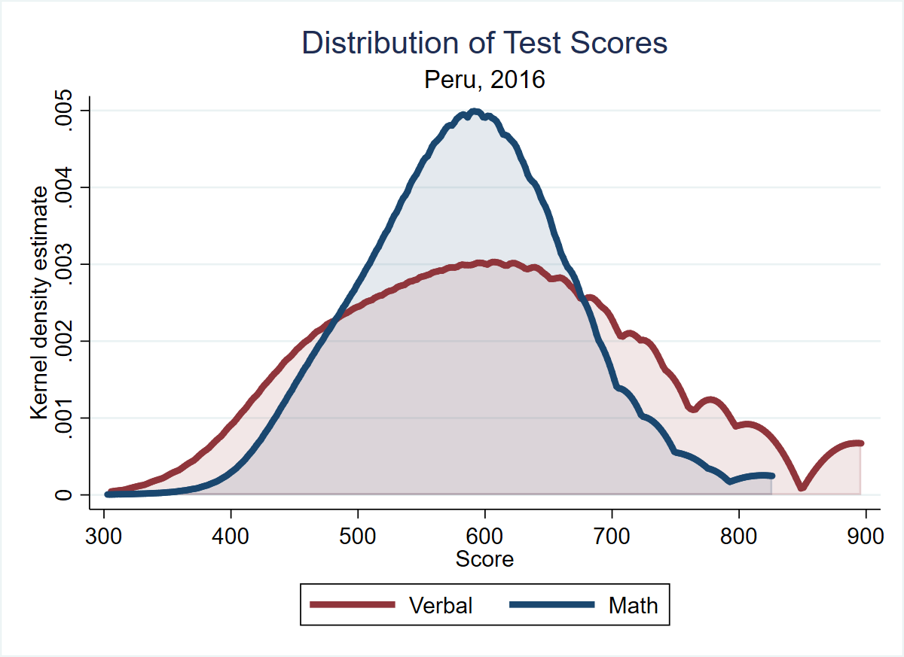
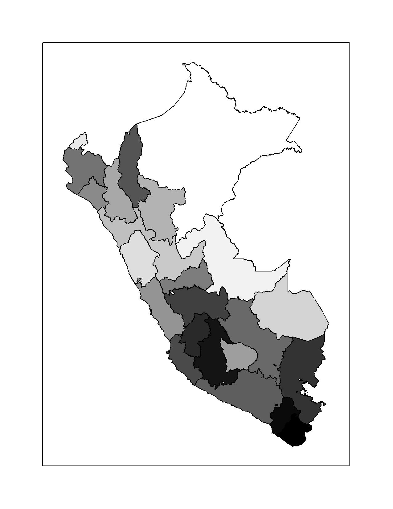
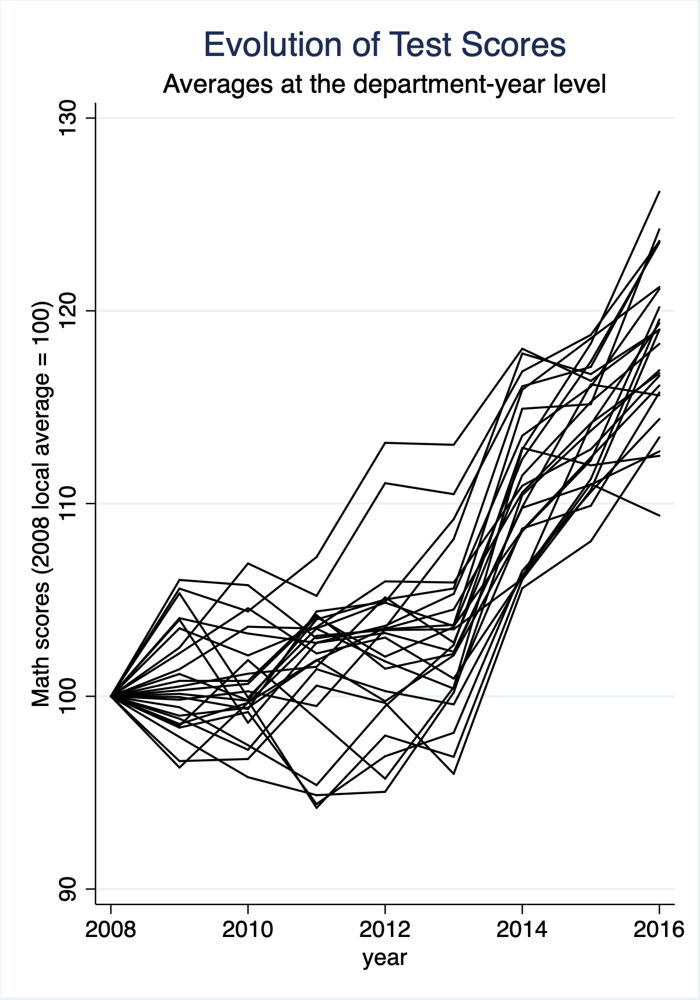

Information available from the author at sebastiansardonbisso@gmail.com. Suggestions are welcome. If you have questions on how to complement this data, contact the author and he'll happily give suggestions.

The ECE test (Evaluacion Censal de Estudiantes) is applied on a yearly basis to all second-grade primary students in Peru. The Ministry of Education (MINEDU) publishes a sample of the ECE dataset, containing around 30% of all scores, in which schools identifiers are encoded and.

Public test results are available on the following webpages:

| Year | Source | Download Link |
|---|---|---|
| 2008 | [MINEDU-ECE 2008](http://umc.minedu.gob.pe/evaluacion-censal-de-estudiantes-2008-ece-2008/) | [Descargar archivos de Muestra de Control ECE 2008](http://www2.minedu.gob.pe/umc/ECE2008/documentos/MC2008.zip) |
| 2009 | [MINEDU-ECE 2009](http://umc.minedu.gob.pe/evaluacion-censal-de-estudiantes-2009-ece-2009/) | [Descargar archivos de Muestra de Control ECE 2009](http://www2.minedu.gob.pe/umc/ece2009/MC2009.zip) |
| 2010 | [MINEDU-ECE 2010](http://umc.minedu.gob.pe/evaluacion-censal-de-estudiantes-2010-ece-2010/) | [Descargar archivos de Muestra de Control ECE 2010](http://www2.minedu.gob.pe/umc/ece2010/MuestradeControl(web)/MC2010M.zip) |
| 2011 | [MINEDU-ECE 2011](http://umc.minedu.gob.pe/evaluacion-censal-de-estudiantes-2011-ece-2011/) | [Descargar archivos de Muestra de Control ECE 2011](http://www2.minedu.gob.pe/umc/ece2011/MuestradeControl(WEB)/MC2011M.zip) |
| 2012 | [MINEDU-ECE 2012](http://umc.minedu.gob.pe/evaluacion-censal-de-estudiantes-2012-ece-2012/) | [Descargar archivos de Muestra de Control ECE 2012](http://www2.minedu.gob.pe/umc/ece2012/MC2012.rar) |
| 2013 | [MINEDU-ECE 2013](http://umc.minedu.gob.pe/evaluacion-censal-de-estudiantes-2013-ece-2013/) | [Descargar archivos de Muestra de Control ECE 2013](http://umc.minedu.gob.pe/wp-content/uploads/2014/03/MC-2013.rar) |
| 2014 | [MINEDU-ECE 2014](http://umc.minedu.gob.pe/evaluacion-censal-de-estudiantes-2014-ece-2014/) | [Descargar archivos de Muestra de Control ECE 2014](http://umc.minedu.gob.pe/wp-content/uploads/2015/02/MC2014.zip) |
| 2015 | [MINEDU-ECE 2015](http://umc.minedu.gob.pe/evaluacion-censal-de-estudiantes-ece-2015/) | [Descargar Archivos de Muestra de Control ECE 2015 Primaria](http://umc.minedu.gob.pe/wp-content/uploads/2016/03/muestralECE2015.zip) |
| 2016 | [MINEDU-ECE 2016](http://umc.minedu.gob.pe/resultadosece2016/) | [Descargar archivos](http://umc.minedu.gob.pe/wp-content/uploads/2017/04/2P_MC_2016-1.zip) |

Instructions:\
Step 1: Download raw ECE data following the links in the table above. The data is published in SPSS format. Alternatively, the same data translated to Stata format is avaiable [here](https://www.dropbox.com/sh/h1g0ihd0l0lurt1/AABrIdz-2-JZNDJBR2Pc6sjua?dl=0).\
Step 2: Clean raw data using the script "Clean ECE (web version).do".

Output dataset available [here](https://www.dropbox.com/sh/m5ribco4nsoeb7z/AADbYWg_xOyvt4wwDKAhzucWa?dl=0).

The following figure can be replicated with the dataset:

  
   

